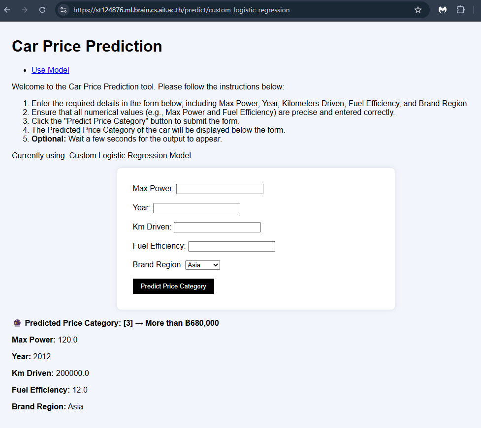

# **A3 Car Price Prediction - st124876**

## **Project Description**
This project redefines car price prediction as a **multi-class classification** problem by categorizing `selling_price` into 4 classes (e.g., low, medium-low, medium-high, high). We use a **custom logistic regression model** implemented from scratch to predict the class.

The model logs training progress to **MLflow every 700 iterations**, allowing transparent experiment tracking. All classification metrics (accuracy, precision, recall, f1-score) are computed manually and validated against scikit-learn.

This project also demonstrates modern MLOps best practices including:
- Custom preprocessing
- MLflow experiment tracking
- Ridge (L2) regularization support
- Dockerized deployment using FastAPI
- CI/CD via GitHub Actions

---

## **🧪 Model Features**

- **Classification** based on selling price brackets

- **Custom Logistic Regression** class with:
  - Accuracy, Precision, Recall, F1-Score (per-class, macro, weighted)
  - Ridge Regularization
- **Manual metric calculations** for deeper understanding
- **Experiment Logging** to MLflow every 700 iterations

---

## **🔍 Dataset Preprocessing**

- Cleaned and updated dataset from `cars_updated.csv`
- Bucketed `selling_price` using `pd.cut()` to 4 classes
- Encoded categorical features and normalized numerical features

---

## **🚀 How to Run Locally**

```bash
docker compose up --build
```

## **🔎 MLflow Tracking**
```bash
Tracking URI: https://mlflow.cs.ait.ac.th/
```
- Experiment name: st124876-a3
- Model logged every 700 iterations
- Best model registered as: st124876-a3-model/4

## **🛠 CI/CD Pipeline**
GitHub Actions Workflows:
```bash
build_test.yml: Runs unit tests and builds Docker image
```
```
test-model-staging.yml: Tests model logic (input/output shape)
```
Auto-deploys upon passing unit tests

## **🌐 Deployment Status**
- Deployment fully completed
- Successfully tested locally via FastAPI server

## **📂 Folder Structure**

```bash
.
├── app/                      # FastAPI app
├── datasets/                # Original and updated dataset
├── preprocess_v2/           # Encoders and scalers
├── source_code/             # Jupyter notebooks and preprocessed data
├── my_model/                # Custom model implementation
├── mlruns/                  # MLflow run tracking
├── models/                  # Saved models
├── templates/               # index.html for frontend
├── static/                  # CSS styling
├── tests/                   # Unit tests for model and app
├── .github/workflows/       # CI/CD configuration
└── README.md
```

## **🤝 Contributors**
- Chaklam Silpasuwanchai
- Akraradet Sinsamersuk

## **Example of predicting website UI**
