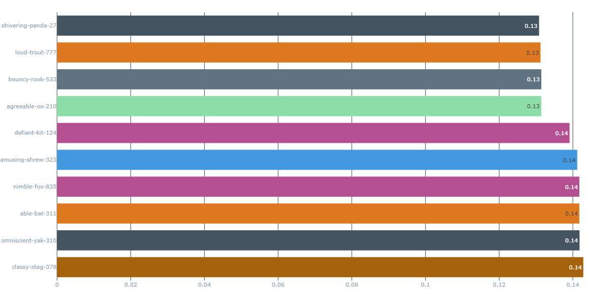
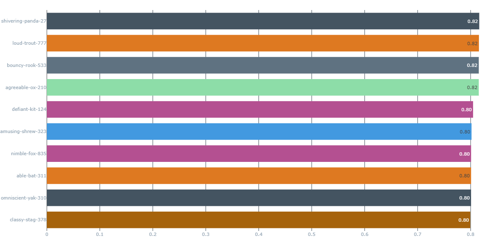

# **🚗 Car Price Prediction - UPDATED**
### **By Patsakorn st124876 in Machine Learning 2025 Jan Semester.**
## **Project Description**
A machine learning-based web application that predicts the price of cars based on user-provided specifications. This project uses supervised learning algorithms and provides a web interface for user interaction.
This repository contains an improved Car Price Prediction web application built using FastAPI, Docker, and Machine Learning models. It allows users to predict the price of a car based on various input features using either an Old Model or an Updated Model. The project includes:
- A trained machine learning model (old model).
- A trained machine learning model (new model). 
- A FastAPI-based backend.
- An improved website's features for chossing old/new model while still keeping the simple web interface for ease of use.
## **📌 Features**
- 🔍 Car Price Prediction based on key attributes like Max Power, Year, Kilometers Driven, Fuel Efficiency, and Brand Region.
- 📊 Two Machine Learning Models available for prediction: Old Model and New Model.
- 🌐 FastAPI Web Interface for easy user interaction.
- 🐳 Docker Integration to run the application in a containerized environment.
- 📄 Jupyter Notebooks & Model Training Scripts included for ML model development.
## **🛠 Technologies Used**
- Programming Language: Python
- Machine Learning Libraries: Scikit-learn, NumPy, Pandas
- Web Framework: FastAPI
- Frontend: HTML (Jinja2 templates), JavaScript
- Deployment: Docker & GitHub
## **📂 Updated File Structure**
- 📌 main.py → Backend implementation using FastAPI.
- 📌 templates/ → HTML templates for the web interface (Jinja2).
- 📌 model/ → Pre-trained machine learning model files (Old Model).
- 📌 new_model_v2/ → Improved version of the model (New Model).
- 📌 preprocess/ → Preprocessing files (e.g., scalers, encoders).
- 📌 preprocess_v2/ → Updated preprocessing pipeline for the new model.
- 📌 A2_Car_Price_Prediction_UPDATED_V9.ipynb → Jupyter notebook for model training & evaluation.
- 📌 Cars.csv → Dataset used for training & evaluation.
- 📌 Dockerfile → Docker setup for containerizing the application.
- 📌 docker-compose.yaml → Configuration for deploying via Docker Compose.
- 📌 .gitignore → Excluded files from version control.
## **Result of tests on $MSE$ and $R^2$ for top 10 best models via MLFlow below:**

